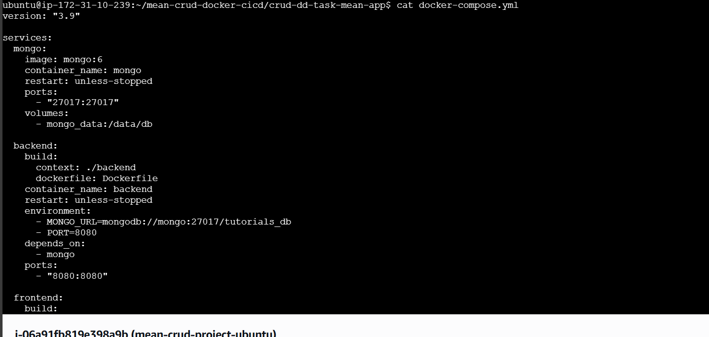

# MEAN CRUD Application — Docker & CI/CD

## 📖 Project Overview

This project is a full-stack **MEAN application** (MongoDB, Express, Angular, Node.js) containerized with Docker, deployed on an **Ubuntu VM (AWS EC2)**, and automated with **GitHub Actions CI/CD**. The entire app is served via **Nginx reverse proxy on port 80**.

---

## 📂 Repository Setup

Create a new GitHub repository and push the project code:

```bash
git init
git remote add origin https://github.com/navyasattineni/mean-crud-docker-cicd.git
git add .
git commit -m "Initial commit"
git push origin main
```

## 🐳 Containerization & Deployment  

### Frontend & Backend Dockerfiles  

- **Backend Dockerfile (Node.js/Express API)**  
  - Uses `node:18-alpine` base image  
  - Installs dependencies from `package.json`  
  - Copies code into the container  
  - Exposes port `8080` (API)  
  - Starts app with `node server.js`  

- **Frontend Dockerfile (Angular App with Nginx)**  
  - Uses `node:18-alpine` to build Angular app (`npm run build`)  
  - Copies the built Angular `dist/` files into `nginx:alpine`  
  - Replaces default Nginx config with custom `nginx.conf`  
  - Exposes port `80` (serves Angular + proxies `/api` to backend)  

### Build Docker images locally  
```bash
docker-compose build
```

### Push Docker images to Docker Hub
```bash

docker login
docker-compose push
```
### Set up Ubuntu VM (EC2)

1. Launch an Ubuntu EC2 instance on AWS.

2. Connect to the instance:
using EC2 Instance Connect from the AWS Console (browser terminal),

Or via SSH from your local machine:

### Install Docker & Compose on VM
```bash
sudo apt update
sudo apt install -y docker.io docker-compose
```
### Clone the repo on server:
```bash
git clone https://github.com/navyasattineni/mean-crud-docker-cicd.git
cd mean-crud-docker-cicd
```
### Deploy with Docker Compose:
```bash
docker-compose pull
docker-compose up -d
```

## 🗄️ Database Setup

We used official MongoDB Docker image (via Docker Compose):
```yaml
mongo:
  image: mongo:6
  volumes:
    - mongo_data:/data/db
```


## 🐳 Docker Compose Setup
The `docker-compose.yml` file (at the root of this repo) defines the stack:

- **mongo** → official `mongo:6` image, data stored in a Docker volume  
- **backend** → Node.js/Express API (`navyasattineni/mean-backend:latest`)  
- **frontend** → Angular app served by Nginx (`navyasattineni/mean-frontend:latest`)  

#### Commands
- Build & run:
  ```bash
  docker-compose build
  docker-compose up -d
  ```
Stop services:
```bash
docker-compose down
```
Pull new images (CI/CD step):
```bash
docker-compose pull
docker-compose up -d
```
Check running containers:
```bash
docker-compose ps
```


## 🔄 CI/CD Pipeline (GitHub Actions)

Configured `.github/workflows/ci-cd.yml`.

On each push to **main**:

- Builds frontend & backend Docker images  
- Pushes images to Docker Hub  
- On EC2 (self-hosted runner) runs:
```bash
  docker-compose pull
  docker-compose down
  docker-compose up -d --pull always
```

## 🌐 Nginx Reverse Proxy

Nginx serves Angular build files and proxies API calls to backend:

Entire application available at:
```bash
http://<EC2_PUBLIC_IP>/
```

## 📂 Project Structure

```bash
mean-crud-docker-cicd/
└── crud-dd-task-mean-app/
    ├── .github/
    │   └── workflows/
    │       └── ci-cd.yml       
    │
    ├── backend/
    │   └── Dockerfile          
    │
    ├── frontend/
    │   ├── Dockerfile           
    │   └── nginx.conf           
    │
    ├── docker-compose.yml      
    ├── README.md                
    └── screenshots/             
	├── 1-compose-file.png              
	├── 2-Dockerfiles.png              
	├── 3-nginx-conf.png                
        ├── 4-dockerhub-images.png        
        ├── 5-docker-ps.png               
	├── 6-github-actions-run.png               
	├── 7-github-secrets.png                   
	├── 8-ci-cd-yml.png                         
	├── 9-frontend-build.png                     
	├── 10-backend-build.png                    
	├── 11-mongod-status-version.png       
	└── 12-app-browser.png           
```

## 📸 Screenshots

Here are the required screenshots for verification:

### 1. Docker & Compose Setup
- 
- 
- 
- 
- 

### 2. CI/CD Pipeline
- 
- 
- 

### 3. Build & Deployment
- 
- 
- 
- 
